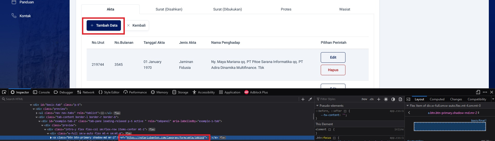
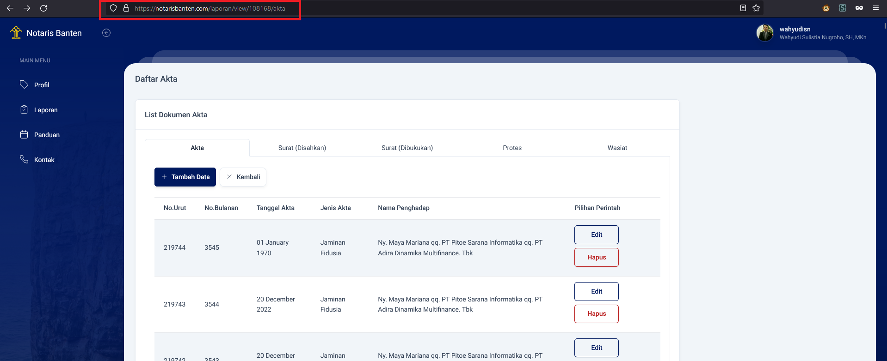

# Webscrapper for NotarisBanten

[Download](https://github.com/AldoRyanEfendi/Webscrapper_for_NotarisBanten/archive/refs/heads/master.zip)

1. Download [python 3.9](https://www.python.org/downloads/release/python-390/)
2. Buka CMD di folder yang sama dengan file main.py
3. Jalankan ```pip install -r req.txt```

# How To Run
## Menjalankan program
1. Buka CMD di folder yang sama dengan file main.py
2. Jalankan ```python main.py```
## Automasi mengisi data
1. Isi data login dengan menekan tombol ```Login```
2. Isi detail dengan menekan tombol ```Detail```
3. Mulai mengisi data otomatis dengan menekan tombol ```Start```
> ### Cara mendapatkan URL untuk mengisi data
> 1. Buka halaman untuk menambah data
> 2. Klik kanan tombol Tambah Data
> 3. Klik inspect element
> 4. Copy URL dari href yang muncul
> 

## Automasi menghapus data
1. Isi data login dengan menekan tombol ```Login```
1. Masuk ke menu hapus dengan menekan tombol ```Delete```
2. Masukan URL & jumlah data yang akan dihapus
3. Tekan tombol ```Start``` untuk memulai penghapusan
> ### Cara mendapatkan URL untuk menghapus data
> 1. Buka halaman untuk menghapus data
> 1. Lalu copy URL di web browser
> 